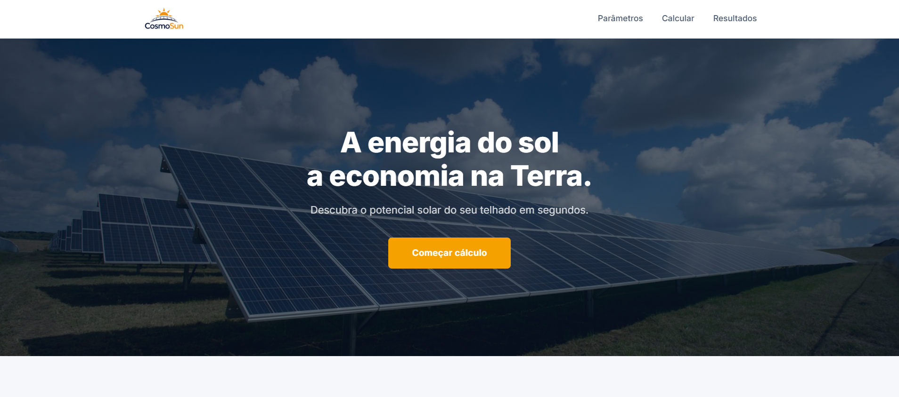
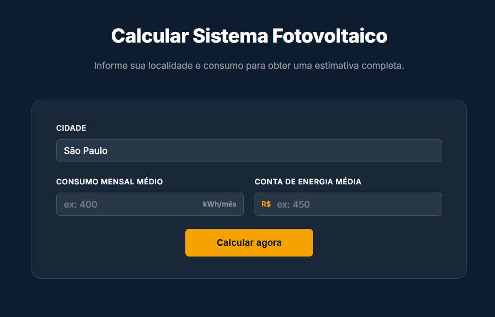
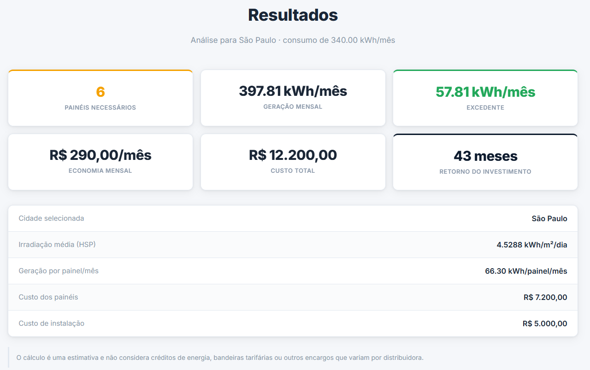
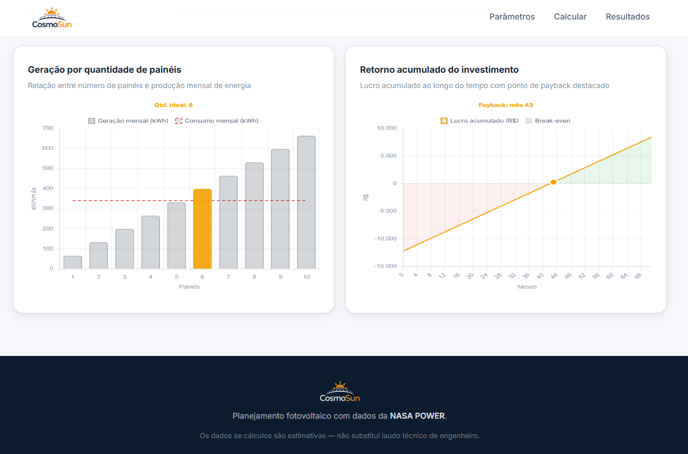

**Acesse o site aqui**: https://felipesantosribas.github.io/CosmoSun/

# ☀️ CosmoSun

**Planejamento fotovoltaico inteligente utilizando dados espaciais da NASA POWER API**

O **CosmoSun** é uma plataforma web desenvolvida para estimar a viabilidade de sistemas fotovoltaicos residenciais utilizando dados reais de irradiação solar obtidos por satélites e modelos climáticos da NASA.

O projeto foi desenvolvido para a **Global Solution FIAP**, unindo conceitos de **Engenharia de Software**, **Modelagem Matemática**, **Sustentabilidade** e **Tecnologias Espaciais** para auxiliar usuários na tomada de decisão sobre investimentos em energia solar.

---

## 🚀 O Problema

Apesar do crescimento da energia solar no Brasil, muitas pessoas ainda possuem dificuldades para responder perguntas importantes como:

* Quantos painéis solares preciso instalar?
* Quanto de energia o sistema irá gerar?
* Qual será minha economia mensal?
* Em quanto tempo o investimento se paga?
* Vale a pena instalar energia solar na minha cidade?

O CosmoSun foi criado para responder essas perguntas de forma simples e acessível.

---

## 🛰️ Dados Vindos do Espaço

O principal diferencial do projeto é a utilização de informações obtidas através da **NASA POWER API**.

A NASA POWER (Prediction Of Worldwide Energy Resources) disponibiliza dados climáticos e energéticos derivados de:

* Satélites meteorológicos;
* Sensoriamento remoto;
* Modelos atmosféricos globais;
* Observações climáticas históricas.

Utilizando essas informações, o CosmoSun consegue estimar a incidência média de energia solar em diferentes regiões do Brasil.

### Fluxo dos dados

NASA POWER API → Aplicação Java → cidades.json → Site CosmoSun

O processo funciona da seguinte forma:

1. Uma aplicação em **Java** consulta a NASA POWER API;
2. Os dados de irradiação solar são coletados para diversas cidades brasileiras;
3. As informações são armazenadas em um arquivo `cidades.json`;
4. O site utiliza esses dados para realizar todos os cálculos em tempo real no navegador do usuário.

---

## 📊 Funcionalidades

O sistema permite calcular:

* Quantidade necessária de painéis solares;
* Geração mensal estimada;
* Excedente ou déficit de geração;
* Custo total do sistema;
* Economia mensal estimada;
* Tempo de retorno do investimento (Payback);
* Gráfico de geração por quantidade de painéis;
* Gráfico de retorno financeiro acumulado.

---

## 🧮 Modelo Matemático

A geração mensal por painel é estimada pela equação:

[
G = P \times HSP \times 30 \times PR
]

Onde:

| Variável | Descrição                    |
| -------- | ---------------------------- |
| P        | Potência do painel (kW)      |
| HSP      | Horas de Sol Pico da região  |
| 30       | Média de dias por mês        |
| PR       | Performance Ratio do sistema |

---

## ⚙️ Parâmetros Configuráveis

O usuário pode personalizar:

* Potência do painel;
* Performance Ratio (PR);
* Preço por painel;
* Custo de instalação;
* Valor da conta mínima de energia.

Isso permite adaptar os cálculos para diferentes equipamentos e cenários reais.

---

## 🛠️ Tecnologias Utilizadas

### Front-end

* HTML5
* CSS3
* JavaScript
* Chart.js

### Back-end de coleta de dados

* Java
* NASA POWER API

### Dados

* JSON

---

## 📸 Imagens

### Página Inicial

<!-- Inserir imagem aqui -->

---

### Tela de Cálculo

<!-- Inserir imagem aqui -->

---

### Resultados

<!-- Inserir imagem aqui -->

---

### Gráficos

<!-- Inserir imagem aqui -->

---

## 🌎 Objetivos de Desenvolvimento Sustentável (ODS)

O projeto está alinhado com os seguintes objetivos da ONU:

### ODS 7 — Energia Limpa e Acessível

Promover o acesso a fontes de energia renováveis.

### ODS 9 — Indústria, Inovação e Infraestrutura

Aplicação de tecnologias espaciais e desenvolvimento de soluções digitais.

### ODS 11 — Cidades e Comunidades Sustentáveis

Incentivo à geração distribuída de energia limpa.

### ODS 13 — Ação Contra a Mudança Global do Clima

Redução da dependência de fontes energéticas baseadas em combustíveis fósseis.

---

## 👥 Integrantes

* Felipe Santos Ribas - RM569121
* Orion Cavalcante França - RM573677
* Luiz Gonzaga - RM572446

---

## 📚 Referências

* NASA POWER Project
* NASA Prediction Of Worldwide Energy Resources (POWER)
* Agência Nacional de Energia Elétrica (ANEEL)
* Empresa de Pesquisa Energética (EPE)

---

## 📄 Licença

Projeto desenvolvido para fins acadêmicos na FIAP.
